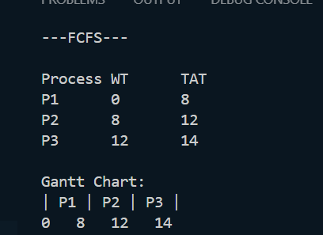
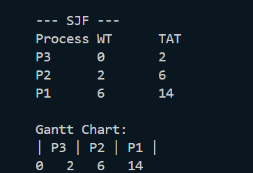
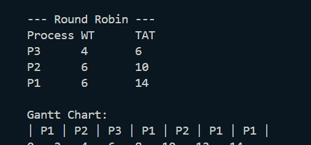

# CPU Scheduling Algorithms in Python

## 📌 Description

This project simulates CPU Scheduling algorithms used in Operating Systems.

## 🚀 Algorithms Implemented

* First Come First Serve (FCFS)
* Shortest Job First (SJF)
* Round Robin (RR)

## ⚙️ Features

* Calculates Waiting Time (WT)
* Calculates Turnaround Time (TAT)
* Displays Gantt Chart

## ▶️ How to Run

```bash
python cpu_scheduler.py
```

## 📊 Sample Output

(Add screenshot here)

## 🛠️ Tech Stack

* Python

## 📊 Output Screenshots

### FCFS


### SJF


### Round Robin


